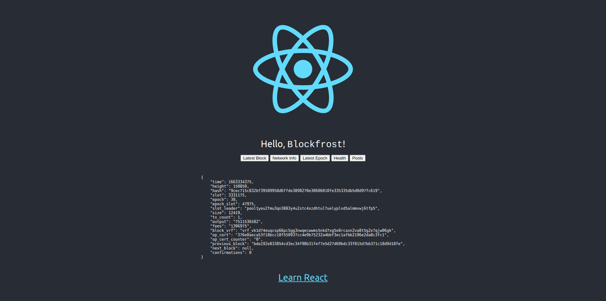

# Porter React/blockfrost-js
React/[blockfrost-js](https://github.com/blockfrost/blockfrost-js) deployed on [Porter](https://react-blockfrost-2f2f5a5c7fe7f52f.onporter.run). 
This project was bootstrapped with [Create React App](https://github.com/facebook/create-react-app). 


### [`/package.json/scripts`](package.json#L5)
The scripts in [`/package.json`](package.json#L5) are meant to be run by Porter.
```json
"scripts": {
  "start": "cd backend && npm start",
  "build": "cd frontend && npm run build"
}
```

## Porter app dashboard
Container settings:
```
- Container Port = 55555
```

Environment variables:
```
- BF_PID = Blockfrost API Key
```
